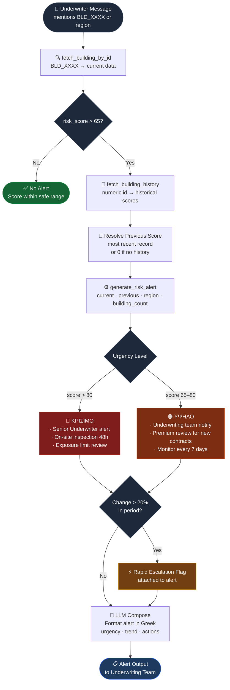

# Alerting Agent — Workflow

## Node Reference

| Node | Type | Tool / Logic |
|------|------|-------------|
| Underwriter Message | Trigger | BLD_XXXX detected in input |
| fetch_building_by_id | Tool call | Returns current `risk_score`, `prefecture`, numeric `id` |
| risk_score > 65? | Gate | Hard threshold — exits early if safe |
| fetch_building_history | Tool call | Returns year-by-year score records |
| Resolve Previous Score | Transform | `history[-1].risk_score` or `0` if empty |
| generate_risk_alert | Tool call | Computes change %, trend label, action list |
| Urgency Level | Router | > 80 → ΚΡΙΣΙΜΟ · 65–80 → ΥΨΗΛΟ |
| Change > 20%? | Gate | Attaches rapid escalation flag |
| LLM Compose | LLM (Llama 405B) | Narrates structured alert in Greek |
| Alert Output | Response | Delivered to underwriting team in chat |

## Urgency Thresholds

| Score | Level | Color | Key Action |
|-------|-------|-------|------------|
| > 80 | ΚΡΙΣΙΜΟ | 🔴 | Immediate senior escalation + 48h inspection |
| 65–80 | ΥΨΗΛΟ | 🟠 | Underwriting team review + 7-day monitoring |
| 35–65 | ΜΕΤΡΙΟ | 🟡 | Agent does not activate |
| < 35 | ΧΑΜΗΛΟ | 🟢 | Agent does not activate |

## Trend Labels

| Change | Label |
|--------|-------|
| > +10 pts | 📈🔴 ΤΑΧΕΙΑ ΕΠΙΔΕΙΝΩΣΗ |
| +5 to +10 pts | 📈🟡 ΣΤΑΔΙΑΚΗ ΑΥΞΗΣΗ |
| 0 to +5 pts | ↗️ ΕΛΑΦΡΑ ΑΥΞΗΣΗ |
| < −5 pts | 📉🟢 ΒΕΛΤΙΩΣΗ |
| stable | ➡️ ΣΤΑΘΕΡΟΠΟΙΗΣΗ |
